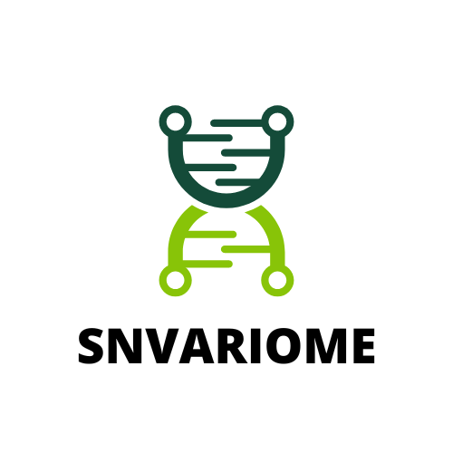

<p align="center">
  
</p>

# SNVariome

A shiny app that integrates protein-protein interactions, clinical variants, & protein structure to enhance the interactome.

View our [app](http://159.65.223.251:3838/home/app/).

## Table of Contents

- [SNVariome](#snvariome)
    - [Background](#Background)
    - [Hackathon Goals](#hackathon-goals)
    - [Data](#data)
    - [Usage](#usage)
        - [Installation](#installation)
        - [Dependencies](#dependencies)
    - [Results](#results)
    - [Team Members](#team-members)
    - [References](#references)

## Background

Most existing PPI databases only curate a binary interactome. However, integrating protein structure is critical in understanding complex human diseases because variants (GOF/LOF) have significant impacts on protein structure. Thus, having a more complete interactome will aid in the identification of pathogenic variants.

SNVariome is a tool that seeks to integrate protein structure, protein-protein interactions, drug-gene interaction data, variant data (using ClinVar, GOF/LOF data), and phenotype data (HPO terms) to develop a comprehensive interactome of clinical variants. We will utilize the SigCom LINCS API and integrate a publicly available dataset that has already examined GOF/LOF impacts on protein structure ([pmcid: PMC9259657](https://www.ncbi.nlm.nih.gov/pmc/articles/PMC9259657/)). Our first test case will be a list of genes/variants associated with breast cancer which should validate and expand the findings of [DOI: 10.1126/science.abf3066](https://www.science.org/doi/10.1126/science.abf3066). 

## Hackathon Goals

During Hackin' Omics, we'd like to:
1. Determine an appropriate way or ways to utilize the EDC values generated regarding GOF/LOF impacts on protein structure of disease genes
2. Integrate the SigCom LINCS API with EDC values for disease genes to identify signatures associated with diseases
3. Implement the Extent of Disease Clustering (EDC) method in a shiny app that incorporates the SigCom LINCS API and other data sources to predict or identify novel pathogenic variants of diseases.


## Data

- [SigCom LINCS](https://maayanlab.cloud/sigcom-lincs/#/) is a web-based search engine or API that serves over 1.5 million gene expression signatures processed, analyzed, and visualized from LINCS, GTEx, and GEO. 
- Extent of Disease Clustering (EDC) values for disease genes via an [excel sheet](https://www.ncbi.nlm.nih.gov/pmc/articles/PMC9259657/bin/41467_2022_31686_MOESM4_ESM.xlsx').
- Manually curated [PPIs](https://www.sciencedirect.com/science/article/pii/S2589004220307185?via%3Dihub#mmc1) from STRING and four additional proteomes-scale interactome studies, i.e., Human Interactome I and II, BioPlex, QUBIC, and CoFrac.

## Usage

Run our shiny app either using the hosted version or via the rconsole.

The input is a gene or variant and the output is signature data, edc values, and PPIs.


### Dependencies

- R 4.2.1
- [RStudio](https://www.rstudio.com/products/rstudio/)

#### R Packages

```r
install.packages(c('shiny', 'BiocManager', 'shinyjs', 'bslib', 'httr', 'jsonlite', 'xml2', 'DT'))

BiocManager::install(c('wppi'))
```


### Steps to run

To run this app, open RStudio and use the below code in the console:

```r
library(shiny)
shiny::runGitHub(username = "u-brite", repo = "SNVariome", ref = "main", subdir = "app")
```

## Results

After using the human protein interactome to find protein-protein interactions across a list of clinic variants classified as either gain of function, loss of function, or haploinsufficient, we found that out of the over 1200 genes indicated in protein interaction, only 104 of the 135 with autosomal dominant inheritance were found to have interactions in the interactome. We chose autosomal dominant genes since there is a highly significant tendency for disease mutations in AD genes to be more clustered.

While applying our methods, we found that we were able to see that our networks supported the literature and ultimately extended the knowledge-base by adding data regarding signatures. Specifically, looking at BRCA1 (breast cancer) has shown us novel signatures and interactions not seen in literature up until our analysis.


## Team Members

[Shaurita Hutchins](https://github.com/sdhutchins) | Team leader   
[Bernhard Hane](https://github.com/swiss-made) | Team member   
[Oladosu Tosin Ayodeji](https://github.com/AIT1995) | Team member   
[Bharat Mishra](https://github.com/bharatm26) | Team member  
[Hailey Levi](https://github.com/orgs/u-brite/people/chaoticsci) | Team member  
[Pooja Singaravelu](https://github.com/orgs/u-brite/people/Poojas241) | Team member  
[Maria Jose](https://github.com/MariaJose501) | Team member

## References

Gerasimavicius L, Livesey BJ, Marsh JA. Loss-of-function, gain-of-function and dominant-negative mutations have profoundly different effects on protein structure. Nat Commun. 2022 Jul 6;13(1):3895. [doi: 10.1038/s41467-022-31686-6](https://www.ncbi.nlm.nih.gov/pmc/articles/PMC9259657/). PMID: 35794153; PMCID: PMC9259657.

Kim M, Park J, Bouhaddou M, Kim K, Rojc A, Modak M, Soucheray M, McGregor MJ, O'Leary P, Wolf D, Stevenson E, Foo TK, Mitchell D, Herrington KA, Muñoz DP, Tutuncuoglu B, Chen KH, Zheng F, Kreisberg JF, Diolaiti ME, Gordan JD, Coppé JP, Swaney DL, Xia B, van 't Veer L, Ashworth A, Ideker T, Krogan NJ. A protein interaction landscape of breast cancer. Science. 2021 Oct;374(6563):eabf3066. [doi: 10.1126/science.abf3066](https://www.science.org/doi/10.1126/science.abf3066). Epub 2021 Oct 1. PMID: 34591612; PMCID: PMC9040556.
